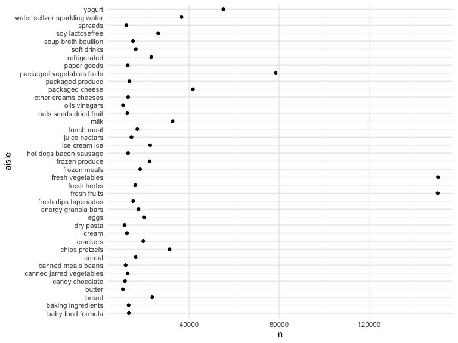
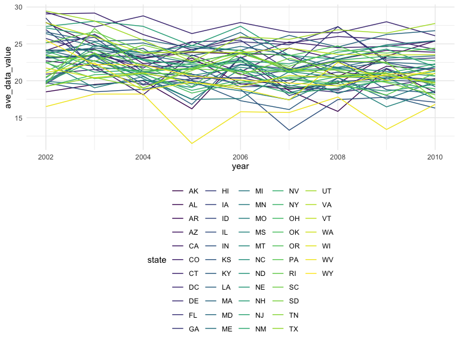
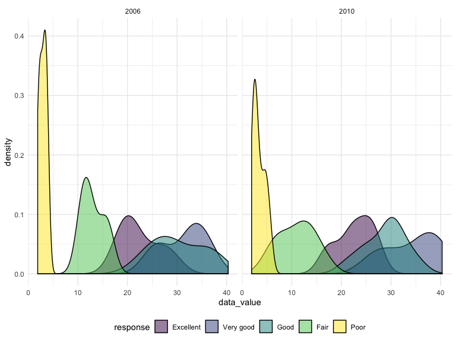
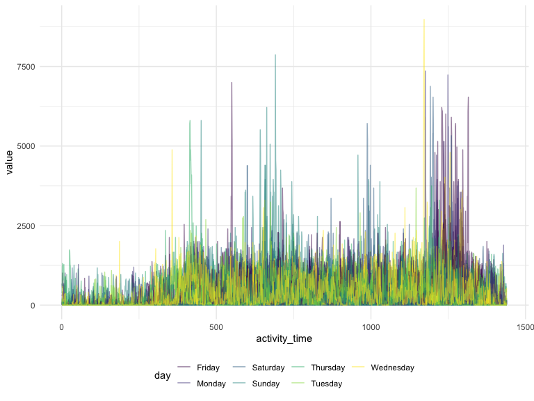

p8105\_hw3\_ob2305
================
Olya Besedina

# Problem 1

How many aisles are there, and which aisles are the most items ordered
from?

There are 134 isles and most items are ordered from the fresh vegetables
aisle.

``` r
instacart %>% 
  count(aisle)
```

    ## # A tibble: 134 x 2
    ##    aisle                      n
    ##    <chr>                  <int>
    ##  1 air fresheners candles  1067
    ##  2 asian foods             7007
    ##  3 baby accessories         306
    ##  4 baby bath body care      328
    ##  5 baby food formula      13198
    ##  6 bakery desserts         1501
    ##  7 baking ingredients     13088
    ##  8 baking supplies decor   1094
    ##  9 beauty                   287
    ## 10 beers coolers           1839
    ## # … with 124 more rows

``` r
instacart %>% 
  count(aisle, sort = TRUE) %>% 
  knitr::kable()
```

| aisle                         |      n |
| :---------------------------- | -----: |
| fresh vegetables              | 150609 |
| fresh fruits                  | 150473 |
| packaged vegetables fruits    |  78493 |
| yogurt                        |  55240 |
| packaged cheese               |  41699 |
| water seltzer sparkling water |  36617 |
| milk                          |  32644 |
| chips pretzels                |  31269 |
| soy lactosefree               |  26240 |
| bread                         |  23635 |
| refrigerated                  |  23228 |
| ice cream ice                 |  22676 |
| frozen produce                |  22453 |
| eggs                          |  19875 |
| crackers                      |  19592 |
| frozen meals                  |  18221 |
| energy granola bars           |  17449 |
| lunch meat                    |  16957 |
| soft drinks                   |  16279 |
| cereal                        |  16201 |
| fresh herbs                   |  16052 |
| fresh dips tapenades          |  15142 |
| soup broth bouillon           |  15109 |
| juice nectars                 |  14350 |
| packaged produce              |  13460 |
| baby food formula             |  13198 |
| baking ingredients            |  13088 |
| other creams cheeses          |  12820 |
| hot dogs bacon sausage        |  12813 |
| paper goods                   |  12694 |
| canned jarred vegetables      |  12679 |
| nuts seeds dried fruit        |  12532 |
| cream                         |  12356 |
| spreads                       |  12102 |
| canned meals beans            |  11774 |
| candy chocolate               |  11453 |
| dry pasta                     |  11298 |
| oils vinegars                 |  10620 |
| butter                        |  10575 |
| cookies cakes                 |   9980 |
| instant foods                 |   9917 |
| breakfast bakery              |   9851 |
| condiments                    |   9743 |
| pasta sauce                   |   9736 |
| frozen breakfast              |   9729 |
| tea                           |   9376 |
| spices seasonings             |   9279 |
| frozen appetizers sides       |   8870 |
| coffee                        |   8392 |
| tortillas flat bread          |   8353 |
| missing                       |   8251 |
| frozen pizza                  |   7661 |
| asian foods                   |   7007 |
| popcorn jerky                 |   6917 |
| fruit vegetable snacks        |   6741 |
| hot cereal pancake mixes      |   6352 |
| grains rice dried goods       |   6134 |
| cleaning products             |   5894 |
| packaged poultry              |   5608 |
| poultry counter               |   5208 |
| preserved dips spreads        |   5188 |
| tofu meat alternatives        |   5123 |
| buns rolls                    |   5054 |
| pickled goods olives          |   4882 |
| doughs gelatins bake mixes    |   4758 |
| energy sports drinks          |   4742 |
| frozen vegan vegetarian       |   4727 |
| salad dressing toppings       |   4719 |
| laundry                       |   4636 |
| prepared meals                |   4133 |
| canned fruit applesauce       |   3996 |
| specialty cheeses             |   3873 |
| dish detergents               |   3870 |
| granola                       |   3803 |
| latino foods                  |   3548 |
| frozen meat seafood           |   3341 |
| canned meat seafood           |   3241 |
| meat counter                  |   3159 |
| breakfast bars pastries       |   3144 |
| oral hygiene                  |   3070 |
| prepared soups salads         |   2936 |
| food storage                  |   2906 |
| marinades meat preparation    |   2905 |
| cat food care                 |   2885 |
| honeys syrups nectars         |   2864 |
| soap                          |   2773 |
| body lotions soap             |   2137 |
| vitamins supplements          |   1969 |
| plates bowls cups flatware    |   1959 |
| beers coolers                 |   1839 |
| other                         |   1795 |
| refrigerated pudding desserts |   1729 |
| fresh pasta                   |   1628 |
| trash bags liners             |   1621 |
| dog food care                 |   1612 |
| protein meal replacements     |   1612 |
| frozen breads doughs          |   1532 |
| packaged meat                 |   1526 |
| bakery desserts               |   1501 |
| hair care                     |   1469 |
| trail mix snack mix           |   1463 |
| cold flu allergy              |   1346 |
| red wines                     |   1243 |
| digestion                     |   1205 |
| diapers wipes                 |   1109 |
| baking supplies decor         |   1094 |
| white wines                   |   1088 |
| seafood counter               |   1084 |
| air fresheners candles        |   1067 |
| cocoa drink mixes             |   1062 |
| feminine care                 |   1048 |
| spirits                       |    967 |
| mint gum                      |    962 |
| frozen dessert                |    922 |
| packaged seafood              |    909 |
| muscles joints pain relief    |    897 |
| more household                |    891 |
| deodorants                    |    858 |
| facial care                   |    746 |
| bulk dried fruits vegetables  |    725 |
| indian foods                  |    719 |
| bulk grains rice dried goods  |    634 |
| kosher foods                  |    628 |
| eye ear care                  |    548 |
| first aid                     |    539 |
| skin care                     |    534 |
| shave needs                   |    532 |
| ice cream toppings            |    504 |
| specialty wines champagnes    |    461 |
| kitchen supplies              |    448 |
| baby bath body care           |    328 |
| baby accessories              |    306 |
| frozen juice                  |    294 |
| beauty                        |    287 |

Make a plot that shows the number of items ordered in each aisle,
limiting this to aisles with more than 10000 items ordered. Arrange
aisles sensibly, and organize your plot so others can read it.

``` r
instacart %>% 
  count(aisle, sort = TRUE) %>% 
  filter( n > 10000) %>% 
  ggplot(aes(x = n, y = aisle))+
  geom_point()
```



Make a table showing the three most popular items in each of the aisles
“baking ingredients”, “dog food care”, and “packaged vegetables
fruits”. Include the number of times each item is ordered in your
table.

``` r
bi = instacart %>%
  filter(aisle == "baking ingredients") %>%
  group_by(aisle, product_name) %>% 
  summarize(n = n()) %>% 
  arrange(desc(n)) %>% 
  head(3)

dfc = instacart %>%
  filter(aisle == "dog food care") %>% 
  group_by(aisle, product_name) %>% 
  summarize(n = n()) %>%
  arrange(desc(n)) %>% 
  head(3)

pvf = instacart %>%
  filter(aisle == "packaged vegetables fruits") %>% 
  group_by(aisle, product_name) %>% 
  summarize(n = n()) %>%
  arrange(desc(n)) %>% 
  head(3) 

aisles_3 = 
  bind_rows(bi, dfc, pvf) %>%
  arrange(desc(n))
```

Make a table showing the mean hour of the day at which Pink Lady Apples
and Coffee Ice Cream are ordered on each day of the week; format this
table for human readers (i.e. produce a 2 x 7 table).\!\!\!\!

``` r
instacart %>% 
  select(product_name, order_dow, order_hour_of_day) %>% 
  filter(product_name %in% c("Pink Lady Apples", "Coffee Ice Cream")) %>% 
  group_by(product_name, order_dow) %>% 
  summarize(
    mean_time_of_day = mean(order_hour_of_day)
  ) %>% 
  view()
# produce a 2 x 7 table).!!!!
```

mean of how many times some product was ordered

# Problem 2

``` r
library(p8105.datasets)
data("brfss_smart2010")

brfss = brfss_smart2010 %>%
  janitor::clean_names() %>% 
  filter(topic == "Overall Health") %>%
  rename(
    state = locationabbr, 
    county = locationdesc)
```

Check all possible responses

``` r
brfss %>%
  count(response)
```

    ## # A tibble: 5 x 2
    ##   response      n
    ##   <chr>     <int>
    ## 1 Excellent  2125
    ## 2 Fair       2125
    ## 3 Good       2125
    ## 4 Poor       2125
    ## 5 Very good  2125

Responses include Excellent, Very good, Good, Fair anf Poor, so include
all of them.

Clean and recode df

``` r
brfss = brfss %>%
  filter(response %in% c("Excellent", "Very good", "Good", "Fair", "Poor")) %>% 
  mutate(
    response = factor(response, levels = c("Excellent", "Very good", "Good", "Fair", "Poor"))) %>% 
  arrange(desc(response)) 
```

In 2002, which states were observed at 7 or more locations? What about
in 2010?

``` r
first = brfss %>% 
  filter(year =="2002") %>% 
  group_by(state) %>%
  summarize(n_location = n_distinct(county)) %>% 
  filter(n_location >=7)
```

The CT, FL, MA, NC, NJ, PA are the states which were observed at 7 or
more locations in 2002.

What about in 2010?

``` r
second = brfss %>% 
  filter(year =="2010") %>% 
  group_by(state) %>%
  summarize(n_location = n_distinct(county)) %>% 
  filter(n_location >=7)
```

Construct a dataset that is limited to Excellent responses, and
contains, year, state, and a variable that averages the data\_value
across locations within a state. Make a “spaghetti” plot of this average
value over time within a state (that is, make a plot showing a line for
each state across years – the geom\_line geometry and group aesthetic
will help).

``` r
brfss %>% 
  select(year, state, county, response, data_value) %>% 
  filter(response == "Excellent") %>% 
  group_by(response, year, state) %>% 
  summarize(
    ave_data_value = mean(data_value)
  ) %>% 
  ggplot(aes(x = year, y = ave_data_value, color = state))+
  geom_line()
```



Make a two-panel plot showing, for the years 2006, and 2010,
distribution of data\_value for responses (“Poor” to “Excellent”) among
locations in NY State.

``` r
brfss %>%
  select(state, year, data_value, response) %>% 
  filter(state =="NY", year %in% c(2006, 2010)) %>%
  ggplot(aes(x = data_value, fill = response))+
  geom_density(alpha = .5)+
  facet_grid(~year)
```



# Problem 3

``` r
chf = read_csv(file = "./data/accel_data.csv") %>% 
  janitor::clean_names() %>% 
  drop_na() %>% 
  mutate(
    week_time = if_else(day == "Saturday" | day == "Sunday", "weekend", "weekday")) %>% 
  select(week, day_id, day,week_time, everything()) %>% 
  pivot_longer(
    activity_1:activity_1440,
    names_to = "activity_time",
    names_prefix = "activity_",
    values_to = "value")
```

    ## Parsed with column specification:
    ## cols(
    ##   .default = col_double(),
    ##   day = col_character()
    ## )

    ## See spec(...) for full column specifications.

``` r
view(chf)

# describe data
```

Traditional analyses of accelerometer data focus on the total activity
over the day. Using your tidied dataset, aggregate accross minutes to
create a total activity variable for each day, and create a table
showing these totals. Are any trends apparent?

``` r
chf = chf %>% 
  group_by(week, day) %>% 
  summarize(
    total_activity = sum(value)
  ) %>% 
  ggplot(aes(x = week, y = total_activity, color = day))+
  geom_line()

# describe
```

Accelerometer data allows the inspection activity over the course of the
day. Make a single-panel plot that shows the 24-hour activity time
courses for each day and use color to indicate day of the week. Describe
in words any patterns or conclusions you can make based on this graph.

``` r
hour_data = 
  chf %>%
  group_by(week, day) %>%
  mutate(
   activity_time = as.numeric(activity_time)) %>% 
  mutate(
    hour_activity = (activity_time)%/%60) %>%
  group_by(hour_activity, day, week) %>%
  summarize(
    hour_value = (sum(value))%/%60)
```

``` r
hour_data %>% 
  filter(hour_activity != "24") %>% 
  ggplot(aes(x = hour_value, y = hour_activity, color = day))+
  geom_line()
```


